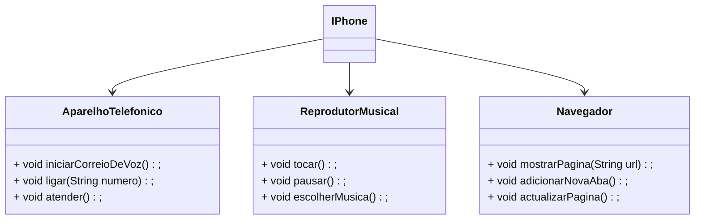

# Dio-projecto-poo

Autor:

- [josue.dosidian](https://github.com/Koder012)
- e-mainl: <josue.dosididan@gmail.com> 

## projecto 

O projecto tem como objectivo a modelagem de uma aplicação. 
Proposto pela dio como parte da avaliação das habilidades adquiridas no curso **Introdução a POO**.

 **Objectivo do projecto**

 - Modelar componentes de IPhone usando diagrama UML.
 - Implementar algumas fucionalidade.

 ## Fucionalidade Implementadas

  > **1. Reprodutor Musical:**
  - `tocar()`, `escolherMusica()`,`pausar()`
  > **2. Aparelho Telefonico:**
  - `ligar()`,`atender()`,`iniciarCorreioDeVoz()`
  > **3. Navegador:**
  - `exibirPagina(String url)`,`adicionarNovaAba()`,`actualizarPagina()`

    ### Diagrama de classes

**Nota:** Usei diagrama de classes no presente documento por não conseguir implementar as interfaces com mermaid.
